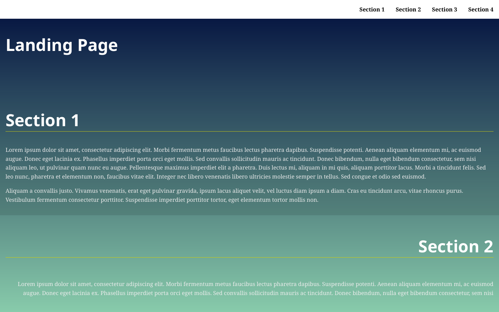

# Dynamic Landing Page

A responsive landing page whose navigation and active-section states are generated dynamically from the document structure.

## Features

- Navigation generated from `section[data-nav]` elements
- Smooth scrolling to sections
- Active section and navigation-link highlighting
- Navigation that hides after inactivity and reappears during interaction
- Return-to-top control
- Responsive layout

## Run locally

```bash
python -m http.server 8000
```

Open `http://localhost:8000`.

## Screenshot


